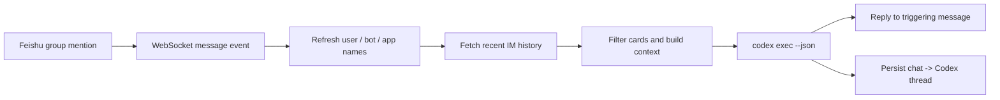

<p align="right">
  🌐 <strong>English</strong> | <a href="README.zh-CN.md">简体中文</a>
</p>

<h1 align="center">agent-in-chat-feishu</h1>

<p align="center">
  Let Codex work inside the real Feishu group-chat loop, with trigger-time history context.
</p>

<p align="center">
  
  
  
  
  
</p>

[Features](#features) • [How It Works](#how-it-works) • [Installation](#installation) • [Feishu App Setup](#feishu-app-setup) • [Usage](#usage)

`agent-in-chat-feishu` is a small Feishu bridge for running Codex in a normal group conversation. Instead of turning the group into a bot-only workspace or relying on hidden/silent context messages, it fetches recent Feishu history when the bot is mentioned, builds a compact context prompt, runs `codex exec --json`, and replies to the triggering message.

It was extracted from the Feishu pieces needed around `cc-connect`, then simplified into a standalone tool focused on one workflow: **mention the bot, let Codex read the recent chat, get a reply in the same conversation.**

## Features

- 💬 **Chat-native Codex loop** — Codex reacts to real group mentions and replies in-thread.
- 🕰️ **Trigger-time history** — recent Feishu group messages are fetched when the mention happens.
- 👥 **Readable names** — user, bot, and app IDs are cached locally as display names.
- ✅ **Processing reactions** — add an `OnIt` reaction while Codex is working, then remove it.
- 🧹 **Progress-card filtering** — interactive card messages are ignored; normal replies remain visible.
- 🧵 **One Codex thread per chat** — each Feishu group resumes its own Codex conversation.
- 🔐 **Optional chat whitelist** — restrict the bot to selected `oc_...` group IDs.
- 🧩 **Self-contained service** — no `cc-connect` daemon, no silent-message mechanism, no broad platform layer.

## How It Works



Here is a simplified comparison between the Feishu group chat and what Codex receives:

| Feishu group messages | Prompt passed to Codex |
| --- | --- |
| <pre>09:42 Maya: I moved tomorrow's meeting notes into the shared doc.<br>09:45 Lin: Great. I still need to add the action items from the design review.<br>09:48 Nova: Let's ask Codex to turn this into a short checklist before lunch.<br>09:51 Maya: @Codex Please pull out what we still need to do today.</pre> | <pre>[Feishu group history]<br>Recent group messages fetched at trigger time. Use them as background and answer the current trigger.<br>[09:42 Maya] I moved tomorrow's meeting notes into the shared doc.<br>[09:45 Lin] Great. I still need to add the action items from the design review.<br>[09:48 Nova] Let's ask Codex to turn this into a short checklist before lunch.<br><br>[Current trigger]<br>Maya: Please pull out what we still need to do today.</pre> |

The bot mention is stripped from the current message, and the trigger itself is kept separate from the history block.

## Installation

Prerequisites:

- Go 1.23 or newer
- A working `codex` CLI
- A Feishu self-built app with bot access and WebSocket events enabled

Build from source:

```bash
git clone https://github.com/sariel/agent-in-chat-feishu.git
cd agent-in-chat-feishu
go build -o agentchat ./cmd/agentchat
```

## Feishu App Setup

Create a new Feishu/Lark app with QR onboarding:

```bash
agentchat setup
```

Or bind an existing app:

```bash
agentchat setup --app cli_xxx:sec_xxx
agentchat auth-url
```

The setup command writes `app_id` and `app_secret` into `~/.agentchat/config.toml` and creates the local data directories. Then open the permissions link printed by setup or `agentchat auth-url`, confirm the requested scopes, and publish or approve the app if Feishu asks.

The built-in permission set covers group mentions, group message history, bot replies, message reactions, member-name lookup, bot/app lookup, and card resources. After setup, also verify that the app subscribes to `im.message.receive_v1` through WebSocket events.

## Configuration

Edit `~/.agentchat/config.toml`:

```toml
data_dir = "~/.agentchat"

[feishu]
app_id = "cli_xxx"
app_secret = "xxx"
base_url = "https://open.feishu.cn"
allowed_chats = []
reaction_emoji = "OnIt"
done_emoji = "none"

[agent]
command = "codex"
work_dir = "."
mode = "auto-edit"
timeout_mins = 30

[context]
max_messages = 100
max_age_mins = 1440
```

Recommended Feishu capabilities:

- Receive IM message events
- Send and reply to messages as bot
- Add and remove message reactions
- Read group message history
- Read group members

The member-read capability is what lets the context say `Maya` instead of `ou_...`.

`reaction_emoji` is added to the triggering message while Codex runs, then removed before the final reply is marked complete. Set it to `"none"` to disable processing reactions. Set `done_emoji = "Done"` if you also want a completion reaction after a successful reply.

## Usage

Start the bridge:

```bash
agentchat run -config ~/.agentchat/config.toml
```

Then mention the bot in a Feishu group:

```text
@Codex summarize the next steps from the last few messages
```

The tool will:

1. Verify the bot was mentioned in a group text message.
2. Refresh local identity mappings for that group.
3. Fetch recent group history from Feishu.
4. Remove interactive progress cards from the context.
5. Resume the chat's Codex thread, or create one on first use.
6. Add and remove Feishu reactions around the run.
7. Reply to the triggering message with Codex's final answer.

## Data Stored Locally

By default, local state lives under `~/.agentchat`:

```text
~/.agentchat/
├── config.toml
├── cache/
│   └── feishu/
│       └── identity_cache.json
└── sessions/
    └── sessions.json
```

## Project Layout

```text
cmd/agentchat/              CLI entrypoint and Feishu setup
internal/agent/             Codex JSON runner and parser
internal/config/            TOML config and defaults
internal/contextbuilder/    Feishu history prompt rendering
internal/feishu/            OpenAPI client and WebSocket runtime
internal/identity/          User / bot / app name cache
internal/store/             Chat-to-Codex-thread persistence
```

## Testing

```bash
go test ./...
go build -o agentchat ./cmd/agentchat
```

## Contributing

Contributions are welcome. Good first areas:

- More message types, especially images and files
- Better deploy examples, such as launchd or systemd
- Multi-tenant / multi-app configuration
- Safer operational docs for Feishu permissions

## License

MIT License

## Acknowledgements

Thanks to [`cc-connect`](https://github.com/chenhg5/cc-connect), whose Feishu integration work inspired and informed this standalone project.
