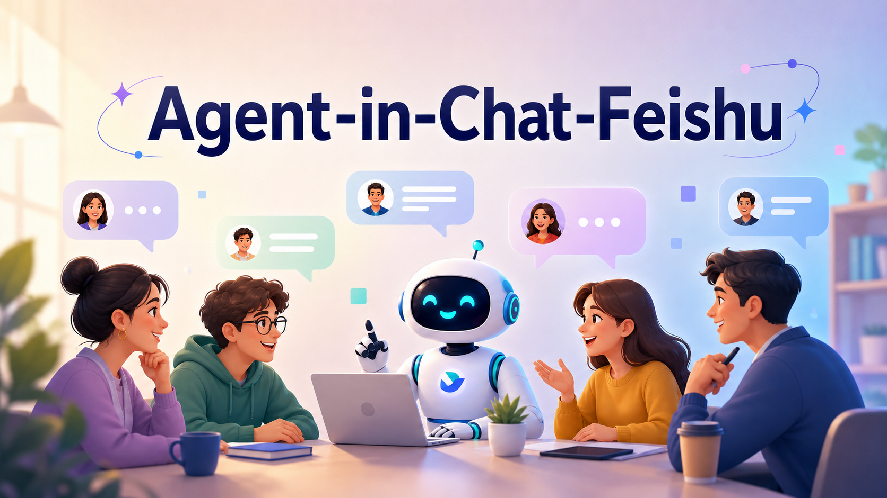

<p align="center">
  
</p>

[English](README.md) | [中文](README.zh-CN.md)

> ⚠️ **Personal-first defaults.** This project is designed primarily for personal or trusted small-team use. The default Codex agent mode is intentionally permissive so it can read local files, call local tools, and act like the agent you would run from your own terminal. For shared, production, or untrusted groups, review `mode`, `admin_from`, chat allowlists, and disabled commands before running it.

Put Codex, Claude Code, and other coding agents into the Feishu chat loop your team already uses.

[](LICENSE)
[](go.mod)
[](docs/feishu.md)

## 🌟 Highlights

- 🚀 Foolproof out-of-the-box setup: install and create a bot with one command `npm install -g @renaissancemind/agent-in-chat-feishu@latest && agentchat setup feishu`
- 🤖 Multiple bots can coexist: the bot can see messages from other bots
- 🧠 Full context: non-@ messages also enter the context, and execution is triggered when the bot is @mentioned
- 🍎 Currently tested mainly on MacOS + Codex

`agent-in-chat-feishu` is a Feishu/Lark-only distribution derived from cc-connect. It keeps the mature agent runtime, sessions, slash commands, providers, progress cards, attachments, cron jobs, relay, management API, and multi-agent support, while removing the concrete adapters for other chat apps and the unused browser admin UI.

The point is not to make your group chat feel like a bot room. The agent joins the ordinary conversation loop: people talk normally, mention the bot when work should happen, and Codex receives the missing group context before it starts.

## ✨ Features

- 💬 **Feishu/Lark first** — bot setup, message receive, reply, cards, reactions, attachments, group history context.
- 🧠 **Agent runtime preserved** — `/model`, `/stop`, `/new`, `/list`, `/switch`, `/history`, `/provider`, `/cron`, `/dir`, `/mode`, `/usage`, `/commands`, `/alias`, `/delete`, `/bind`, `/workspace`.
- 🤝 **Many agents** — Codex, Claude Code, OpenCode, Gemini, Kimi, Qoder, iFlow, Cursor, ACP, Pi.
- 🧩 **Real chat context** — on mention, recent Feishu group history can be fetched, filtered, cached, and injected as background context.
- 🪪 **Readable identities** — Feishu user/app/chat names are cached on disk under `~/.agentchat` so Codex sees names instead of long IDs whenever possible.
- 📌 **Less noise by default** — progress cards are ignored when building group context; readable final reply cards still count.
- 🛠️ **Operational surface kept** — daemon mode, management API, webhook, cron/heartbeat, relay, session store, provider switching, and attachment send-back.

## 💬 How It Feels

Feishu group:

```text
Mina: The deploy failed again after the config change.
Alex: I think the env file is not loaded in the worker.
River: The log says "missing OPENAI_API_KEY", but local dev is fine.
Alex: @agentchat check the recent config and tell us what to fix.
```

What Codex receives:

```text
[Feishu group context]
Mina: The deploy failed again after the config change.
Alex: I think the env file is not loaded in the worker.
River: The log says "missing OPENAI_API_KEY", but local dev is fine.
[/Feishu group context]

Alex: check the recent config and tell us what to fix.
```

Progress cards from this or other bots are skipped. Sender names come from the local identity cache when available; new IDs trigger a Feishu lookup and then get persisted.

## 📦 Installation

```bash
npm install -g @renaissancemind/agent-in-chat-feishu@latest
agentchat --help
```

The npm release installs the matching platform binary from npm optional dependencies, so install does not fetch the CLI from GitHub Releases.

Build from source:

```bash
git clone https://github.com/Renaissance-Mind/agent-in-chat-feishu.git
cd agent-in-chat-feishu
make build
./agentchat --help
```

## 🚀 Quick Start

Create or connect a Feishu/Lark bot and write the project config:

```bash
agentchat setup feishu
```

Connect an existing app:

```bash
agentchat setup feishu --app cli_xxx:sec_xxx
```

`agentchat setup feishu` is the recommended path. It uses Codex as the default agent. Without `--project`, it creates the local bot profile `feishu` and sets its initial work directory to `~/.agentchat/feishu/` next to the config file. That directory is only the starting workspace; you can switch to the real code repository later from chat with `/dir` or `/workspace`. The command writes the platform config, installs/starts the background service, opens the permission confirmation page when possible, and prints the direct permission confirmation link as the final step. QR onboarding usually creates the bot app with core capabilities; when binding an existing app, open the final `scope-apply` permission confirmation link, verify long-connection events, then publish a new app version if Feishu asks for one. You can reprint the links later with `agentchat feishu permissions`, or request tenant approval through the official API with `agentchat feishu permissions --apply`.

`agentchat feishu setup` remains supported as a compatibility alias.

New projects default to chat binding. If `admin_from` is set, the first valid trigger from an admin automatically binds that group or DM and persists its `chat_id`; without an admin match, the bot replies with the `chat_id` to add to `allow_group_chats` or `allow_private_chats`.

Use `--no-start` to write config without starting the service:

```bash
agentchat setup feishu --no-start
```

Background service management:

```bash
agentchat daemon status
agentchat daemon logs -f
agentchat daemon restart
```

Automatic daemon setup captures the current `PATH`, matching cc-connect behavior. If you install from a non-interactive shell or use a custom path manager for the agent CLI, Node.js, or `lark-cli`, pass the service PATH explicitly with `agentchat setup feishu --daemon-env-path "$PATH"`.

## ⚙️ Configuration

Minimal config shape:

```toml
language = "zh"
idle_timeout_mins = 30

[display]
tool_messages = false

[stream_preview]
enabled = true
interval_ms = 1000
min_delta_chars = 10
max_chars = 4000

[[projects]]
name = "my-project"
admin_from = ""
show_context_indicator = false

[projects.agent]
type = "codex"

[projects.agent.options]
work_dir = "/absolute/path/to/my-project"
mode = "yolo"
reasoning_effort = "medium"
model = "gpt-5.5"

[[projects.platforms]]
type = "feishu"

[projects.platforms.options]
app_id = "${FEISHU_APP_ID}"
app_secret = "${FEISHU_APP_SECRET}"
allow_private_chats = ""
allow_group_chats = ""
auto_bind_chats = true
group_context_buffer = true
context_buffer_max_messages = 100
context_buffer_max_age_mins = 0
share_session_in_channel = true
progress_style = "card"
reaction_emoji = "OnIt"
```

The default config and runtime data directory is `~/.agentchat`. See [config.example.toml](config.example.toml) for a fuller Feishu-only example.

With `group_context_buffer = true`, Feishu group history is cached per chat. The first mention gives the agent recent background; later mentions in the same running session inject only newly delivered group messages, so previously sent context is not repeated in the Codex conversation.

## 🔐 Feishu Permissions

For a full bot that behaves like the current runtime, enable robot capability, long-connection event delivery, and these permissions/events:

| Capability | Feishu permission or event |
|---|---|
| Read bot basic info | `application:bot.basic_info:read` |
| Receive group mentions | `im.message.receive_v1` with `im:message.group_at_msg:readonly` and `im:message.group_at_msg.include_bot:readonly` |
| Receive direct messages | `im.message.receive_v1` with `im:message.p2p_msg:readonly` |
| Receive read receipts | `im.message.message_read_v1` |
| Detect direct-chat entry | `im.chat.access_event.bot_p2p_chat_entered_v1` with `im:chat.access_event.bot_p2p_chat:read` |
| Fetch recent group history and quoted messages | `im:message`, `im:message:readonly`, `im:message.group_msg` |
| Send and reply | `im:message` or `im:message:send_as_bot` |
| Update progress/card messages | `im:message:update`, `cardkit:card:write` |
| Recall transient preview messages | `im:message:recall` |
| Add/remove reactions | `im:message.reactions:write_only` |
| Upload/download image/file attachments | `im:resource` |
| Read group metadata and member names | `im:chat:read`, `im:chat.members:bot_access`, `im:chat.members:read` |
| Resolve user names | `contact:contact.base:readonly` |
| Use interactive cards | card callback event `card.action.trigger` |
| Use bot custom menu callbacks | bot menu event `application.bot.menu_v6` |

The setup command prints a Feishu/Lark `scope-apply` permission confirmation URL with the recommended runtime scopes preselected through a comma-separated `scopes` parameter: `application:bot.basic_info:read`, `cardkit:card:write`, `contact:contact.base:readonly`, `im:chat.access_event.bot_p2p_chat:read`, `im:chat.members:bot_access`, `im:chat.members:read`, `im:chat:read`, `im:message`, `im:message.group_at_msg.include_bot:readonly`, `im:message.group_at_msg:readonly`, `im:message.group_msg`, `im:message.p2p_msg:readonly`, `im:message.reactions:write_only`, `im:message:readonly`, `im:message:recall`, `im:message:send_as_bot`, `im:message:update`, and `im:resource`. If your terminal config contains `app_secret`, `agentchat feishu permissions --apply` can request tenant permission approval through Feishu's official `application/v6/scopes/apply` API.

Official references: [one-click Feishu agent app](https://open.feishu.cn/document/mcp_open_tools/integrating-agents-with-feishu/overview), [scope list](https://open.feishu.cn/document/ukTMukTMukTM/uYTM5UjL2ETO14iNxkTN/scope-list), [send messages](https://open.feishu.cn/document/server-docs/im-v1/message/create), [reply](https://open.feishu.cn/document/uAjLw4CM/ukTMukTMukTM/reference/im-v1/message/reply), [receive event](https://open.feishu.cn/document/uAjLw4CM/ukTMukTMukTM/reference/im-v1/message/events/receive), [history](https://open.feishu.cn/document/server-docs/im-v1/message/list), [reactions](https://open.feishu.cn/document/server-docs/im-v1/message-reaction/create?lang=zh-CN), [group members](https://open.feishu.cn/document/uAjLw4CM/ukTMukTMukTM/reference/im-v1/chat-members/get), [image upload](https://open.feishu.cn/document/server-docs/im-v1/image/create).

## 🧭 Commands

Examples you can send in Feishu:

```text
/help
/model
/stop
/new
/history
/provider
/cron
/mode
/usage
```

The CLI is `agentchat`:

```bash
agentchat sessions list
agentchat send --session <session-id> --message "ship a short status update"
agentchat daemon start
```

## 📚 Documentation

- [Feishu setup guide](docs/feishu.md)
- [Install guide](INSTALL.md)
- [Usage guide](docs/usage.md)
- [Management API](docs/management-api.md)
- [Bridge protocol](docs/bridge-protocol.md)

## 🤝 Contributing

Contributions are welcome. Keep the distribution Feishu/Lark-only unless the project direction changes, and keep core agent/runtime behavior compatible with cc-connect where possible.

## 📄 License

[MIT](LICENSE)

## 🙏 Acknowledgements

This project is derived from and deeply indebted to [cc-connect](https://github.com/chenhg5/cc-connect). Thanks to the cc-connect authors and contributors for the original agent runtime, chat command model, and Feishu platform foundation.
