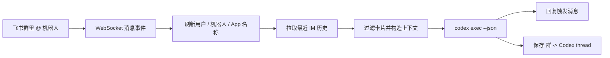

<p align="right">
  🌐 <a href="README.md">English</a> | <strong>简体中文</strong>
</p>

<h1 align="center">agent-in-chat-feishu</h1>

<p align="center">
  让 Codex 进入真实的飞书群聊循环，并在触发时读取最近聊天上下文。
</p>

<p align="center">
  
  
  
  
  
</p>

[功能](#功能) • [工作方式](#工作方式) • [安装](#安装) • [飞书应用配置](#飞书应用配置) • [使用](#使用)

`agent-in-chat-feishu` 是一个轻量的飞书接入工具，用来让 Codex 参与正常的群聊协作。它不是把群聊变成一个机器人工作台，也不依赖隐藏的 silent 上下文消息；当群里 @ 机器人时，它会读取最近的聊天记录，整理成上下文，执行 `codex exec --json`，然后回复触发它的那条消息。

这个项目抽离了 `cc-connect` 里我们真正需要的飞书接入部分，并把新做的“被 @ 时查询历史”的上下文方案独立出来。目标很简单：**在真实群聊里 @ 一下，Codex 看最近聊天，然后在同一个对话里回复。**

## 功能

- 💬 **原生聊天循环** — Codex 响应真实群聊里的 @，而不是另起一个机器人工作流。
- 🕰️ **触发时查询历史** — 每次被 @ 时从飞书 IM 历史接口拉取最近消息。
- 👥 **显示人名** — 本地缓存 user、bot、app 的名称映射，减少 `ou_...` 这类 ID。
- ✅ **处理中表情** — Codex 工作时给触发消息加 `OnIt`，完成后移除。
- 🧹 **过滤进度卡片** — 默认忽略 interactive card，只保留正常文本回复。
- 🧵 **每群一个 Codex 线程** — 不同飞书群会续不同的 Codex conversation。
- 🔐 **可选群白名单** — 可以限制只响应指定 `oc_...` 群。
- 🧩 **独立运行** — 不依赖 `cc-connect` daemon，不迁 silent 机制，也不带完整平台抽象。

## 工作方式



下面是一个简化对比：左边是飞书群里大家实际看到的消息，右边是整理后传给 Codex 的内容。

| 飞书群里的消息记录 | Codex 实际看到的消息 |
| --- | --- |
| <pre>09:42 小林：我把明天会用的会议纪要先放到共享文档里了。<br>09:45 小周：好，我等会儿补一下设计评审里提到的待办。<br>09:48 小夏：中午前要不要让 Codex 先整理一版清单？<br>09:51 小林：@Codex 帮我看看今天还剩哪些事情要处理。</pre> | <pre>[Feishu group history]<br>Recent group messages fetched at trigger time. Use them as background and answer the current trigger.<br>[09:42 小林] 我把明天会用的会议纪要先放到共享文档里了。<br>[09:45 小周] 好，我等会儿补一下设计评审里提到的待办。<br>[09:48 小夏] 中午前要不要让 Codex 先整理一版清单？<br><br>[Current trigger]<br>小林: 帮我看看今天还剩哪些事情要处理。</pre> |

触发消息里的机器人 @ 会被去掉，并单独放进 `[Current trigger]`，不会再重复出现在历史记录里。

## 安装

前置条件：

- Go 1.23 或更新版本
- 可用的 `codex` CLI
- 一个已开启机器人和 WebSocket 事件的飞书自建应用

从源码构建：

```bash
git clone https://github.com/sariel/agent-in-chat-feishu.git
cd agent-in-chat-feishu
go build -o agentchat ./cmd/agentchat
```

## 飞书应用配置

通过扫码引导创建一个新的飞书 / Lark 应用：

```bash
agentchat setup
```

或者关联已有应用：

```bash
agentchat setup --app cli_xxx:sec_xxx
agentchat auth-url
```

`setup` 会把 `app_id` 和 `app_secret` 写入 `~/.agentchat/config.toml`，并创建本地数据目录。然后打开 setup 或 `agentchat auth-url` 打印出来的权限直达链接，确认开通所需 scopes；如果飞书要求发布版本或管理员审批，还需要按页面提示完成。

内置权限集合覆盖群聊 @ 事件、群聊历史消息、机器人回复、消息表情回复、群成员名称映射、机器人 / App 名称映射和卡片资源。setup 之后还需要确认应用已经通过 WebSocket 订阅 `im.message.receive_v1` 事件。

## 配置

编辑 `~/.agentchat/config.toml`：

```toml
data_dir = "~/.agentchat"

[feishu]
app_id = "cli_xxx"
app_secret = "xxx"
base_url = "https://open.feishu.cn"
allowed_chats = []
reaction_emoji = "OnIt"
done_emoji = "none"

[agent]
command = "codex"
work_dir = "."
mode = "auto-edit"
timeout_mins = 30

[context]
max_messages = 100
max_age_mins = 1440
```

建议开启的飞书能力：

- 接收 IM 消息事件
- 以机器人身份发送 / 回复消息
- 添加 / 删除消息表情回复
- 读取群聊消息历史
- 读取群成员列表

读取群成员权限是显示 `小林` 这类名字，而不是 `ou_...` ID 的关键。

`reaction_emoji` 会在 Codex 执行时添加到触发消息上，并在完成前移除；设为 `"none"` 可以关闭处理中表情。如果希望成功回复后再加一个完成表情，可以设置 `done_emoji = "Done"`。

## 使用

启动：

```bash
agentchat run -config ~/.agentchat/config.toml
```

然后在飞书群里 @ 机器人：

```text
@Codex 总结一下刚才讨论的下一步
```

工具会自动：

1. 确认这是一条群聊文本 @ 消息。
2. 刷新该群的本地名称映射。
3. 从飞书拉取最近群聊历史。
4. 从上下文中过滤 interactive 进度卡片。
5. 续上这个群对应的 Codex thread，首次使用则新建。
6. 在执行前后添加 / 移除飞书表情回复。
7. 把 Codex 的最终回答回复到触发消息下面。

## 本地数据

默认本地状态保存在 `~/.agentchat`：

```text
~/.agentchat/
├── config.toml
├── cache/
│   └── feishu/
│       └── identity_cache.json
└── sessions/
    └── sessions.json
```

## 项目结构

```text
cmd/agentchat/              CLI 入口和飞书 setup
internal/agent/             Codex JSON 执行器和解析器
internal/config/            TOML 配置和默认值
internal/contextbuilder/    飞书历史上下文渲染
internal/feishu/            OpenAPI 客户端和 WebSocket 接入逻辑
internal/identity/          用户 / 机器人 / App 名称缓存
internal/store/             群到 Codex thread 的持久化
```

## 测试

```bash
go test ./...
go build -o agentchat ./cmd/agentchat
```

## 贡献

欢迎贡献。比较适合先做的方向：

- 支持更多消息类型，例如图片和文件
- 补充 launchd / systemd 等部署示例
- 支持多租户 / 多应用配置
- 把飞书权限说明写得更安全、更清楚

## 许可证

MIT License

## 致谢

感谢 [`cc-connect`](https://github.com/chenhg5/cc-connect)。本项目的飞书接入和运行方式受到了 `cc-connect` 的启发，也复用了我们围绕它验证出的关键思路。
