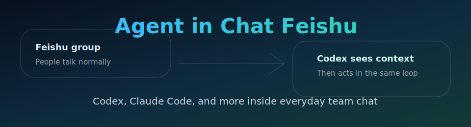

# agent-in-chat-feishu

[English](README.md) | [中文](README.zh-CN.md)

> ⚠️ **默认面向个人使用。** 这个项目主要面向个人或可信小团队场景。默认 Codex Agent 权限会开得比较高，让它能像你在自己终端里运行一样读取本地文件、调用本地工具并完成任务。如果要放到共享、生产或不完全可信的群里，请先检查并收紧 `mode`、`admin_from`、聊天 allowlist 和禁用命令配置。

<p align="center">
  
</p>

把 Codex、Claude Code 和其他编程 Agent 放进团队日常飞书聊天循环里。

[](LICENSE)
[](go.mod)
[](docs/feishu.md)

`agent-in-chat-feishu` 是从 cc-connect 派生出来的飞书/Lark 专用版本。它保留成熟的 Agent 运行时、会话、斜杠命令、模型提供方、进度卡片、附件、定时任务、relay、management API 和多 Agent 支持，同时移除了其他聊天软件的具体适配器以及未使用的浏览器管理前端。

它的重点不是“在群里放一个问答机器人”，而是让 Agent 进入正常聊天 loop：大家照常讨论，需要执行时 @ 它，它会先补齐最近群聊上下文，再开始工作。

## 特性

- 💬 **专注飞书/Lark**：机器人配置、收消息、回复、卡片、表情、附件、群历史上下文。
- 🧠 **保留 cc-connect 核心能力**：`/model`、`/stop`、`/new`、`/list`、`/switch`、`/history`、`/provider`、`/cron`、`/dir`、`/mode`、`/usage`、`/commands`、`/alias`、`/delete`、`/bind`、`/workspace`。
- 🤝 **保留多 Agent 支持**：Codex、Claude Code、OpenCode、Gemini、Kimi、Qoder、iFlow、Cursor、ACP、Pi。
- 🧩 **真实聊天上下文**：被 @ 时可以拉取最近群历史，过滤、缓存后作为背景上下文发送给 Agent。
- 🪪 **更短、更可读的身份信息**：飞书用户、应用和群名称会落盘缓存在 `~/.agentchat`，Codex 尽量看到名字而不是长 ID。
- 📌 **默认少看噪声**：构建群上下文时跳过进度卡片；可读的最终回复卡片仍会进入上下文。
- 🛠️ **保留运行管理面**：daemon、management API、webhook、cron/heartbeat、relay、session store、provider 切换、附件回传。

## 日常场景

飞书群里的消息：

```text
Mina：刚才部署又失败了，好像是在改配置后开始的。
Alex：我怀疑 worker 没读到 env 文件。
River：日志里写的是 missing OPENAI_API_KEY，但本地是好的。
Alex：@agentchat 看下最近配置和日志，告诉我们怎么修。
```

Codex 看到的上下文：

```text
[Feishu group context]
Mina：刚才部署又失败了，好像是在改配置后开始的。
Alex：我怀疑 worker 没读到 env 文件。
River：日志里写的是 missing OPENAI_API_KEY，但本地是好的。
[/Feishu group context]

Alex：看下最近配置和日志，告诉我们怎么修。
```

进度卡片会被跳过；能从本地身份缓存或群成员表解析出来时，发送者会显示为名字。

## 安装

```bash
npm install -g @renaissancemind/agent-in-chat-feishu
agentchat --help
```

npm 包会通过 npm optional dependencies 安装当前系统对应的平台二进制，不会在安装时再从 GitHub Releases 下载 CLI。

从源码构建：

```bash
git clone https://github.com/Renaissance-Mind/agent-in-chat-feishu.git
cd agent-in-chat-feishu
make build
./agentchat --help
```

## 快速开始

新建或连接飞书/Lark 机器人，并写入项目配置：

```bash
agentchat setup feishu
```

关联已有应用：

```bash
agentchat setup feishu --app cli_xxx:sec_xxx
```

推荐使用 `agentchat setup feishu`，默认连接 Codex。不传 `--project` 时，它会创建本地机器人配置 `feishu`，并把默认工作目录设为配置同级的 `~/.agentchat/feishu/`；这个目录只是初始工作区，之后可以在聊天里用 `/dir` 或 `/workspace` 切换到真正要操作的代码仓库。命令会写入平台配置，默认安装/启动后台服务，尽量自动打开权限确认页面，并把权限确认直达链接作为最后一步打印出来；setup 成功后 `agentchat` 已在后台运行。扫码新建通常会创建机器人应用并预配核心能力；关联已有应用时，打开最后打印的 `scope-apply` 权限确认直达链接，再核验长连接事件订阅。如果飞书提示需要发布新版本，补权限或事件后要创建版本并发布。之后也可以用 `agentchat feishu permissions` 重新打印这些链接，或用 `agentchat feishu permissions --apply` 通过官方接口向租户管理员发起权限申请。

`agentchat feishu setup` 仍作为兼容写法保留。

新项目默认使用聊天绑定。如果已设置 `admin_from`，管理员第一次在群聊或私聊中有效触发机器人时会自动绑定该会话并持久化 `chat_id`；如果不是管理员触发，机器人会返回需要加入 `allow_group_chats` 或 `allow_private_chats` 的 `chat_id`。

`--no-start` 可只写配置不启动服务：

```bash
agentchat setup feishu --no-start
```

后台服务管理：

```bash
agentchat daemon status
agentchat daemon logs -f
agentchat daemon restart
```

setup 自动安装 daemon 时会记录当前 `PATH`，与 cc-connect 行为一致。如果你从非交互 shell 安装，或本地 Agent CLI、Node.js、`lark-cli` 来自自定义路径管理器，可以显式传入服务 PATH：

```bash
agentchat setup feishu --daemon-env-path "$PATH"
```

## 配置

最小配置形态：

```toml
language = "zh"
idle_timeout_mins = 30

[display]
tool_messages = false

[stream_preview]
enabled = true
interval_ms = 1000
min_delta_chars = 10
max_chars = 4000

[[projects]]
name = "my-project"
admin_from = ""
show_context_indicator = false

[projects.agent]
type = "codex"

[projects.agent.options]
work_dir = "/absolute/path/to/my-project"
mode = "yolo"
reasoning_effort = "medium"
model = "gpt-5.5"

[[projects.platforms]]
type = "feishu"

[projects.platforms.options]
app_id = "${FEISHU_APP_ID}"
app_secret = "${FEISHU_APP_SECRET}"
allow_private_chats = ""
allow_group_chats = ""
auto_bind_chats = true
group_context_buffer = true
context_buffer_max_messages = 100
context_buffer_max_age_mins = 0
share_session_in_channel = true
progress_style = "card"
reaction_emoji = "OnIt"
```

默认配置和运行数据目录是 `~/.agentchat`。更完整的飞书专用示例见 [config.example.toml](config.example.toml)。

## 飞书权限

如果希望行为和当前运行的机器人一致，需要启用机器人能力、长连接事件，并开通这些权限/事件：

| 能力 | 飞书权限或事件 |
|---|---|
| 获取机器人基础信息 | `application:bot.basic_info:read` |
| 拉取最近群历史和引用消息 | `im:message`、`im:message:readonly`、`im:message.group_msg` |
| 接收群聊 @ 消息 | `im.message.receive_v1`、`im:message.group_at_msg:readonly`、`im:message.group_at_msg.include_bot:readonly` |
| 接收私聊消息 | `im.message.receive_v1` 和 `im:message.p2p_msg:readonly` |
| 接收消息已读事件 | `im.message.message_read_v1` |
| 识别用户进入私聊 | `im.chat.access_event.bot_p2p_chat_entered_v1` 和 `im:chat.access_event.bot_p2p_chat:read` |
| 发送和回复消息 | `im:message` 或 `im:message:send_as_bot` |
| 更新进度/状态卡片 | `im:message:update`、`cardkit:card:write` |
| 撤回临时预览消息 | `im:message:recall` |
| 自动添加/移除表情 | `im:message.reactions:write_only` |
| 上传/下载图片和文件附件 | `im:resource` |
| 读取群信息和群成员名称 | `im:chat:read`、`im:chat.members:bot_access`、`im:chat.members:read` |
| 解析用户名称 | `contact:contact.base:readonly` |
| 使用交互卡片 | 卡片回调事件 `card.action.trigger` |
| 使用机器人自定义菜单回调 | 机器人菜单事件 `application.bot.menu_v6` |

`setup` 会打印飞书/Lark 的 `scope-apply` 权限确认直达链接，并用逗号分隔的 `scopes` 参数预选运行时推荐 scopes：`application:bot.basic_info:read`、`cardkit:card:write`、`contact:contact.base:readonly`、`im:chat.access_event.bot_p2p_chat:read`、`im:chat.members:bot_access`、`im:chat.members:read`、`im:chat:read`、`im:message`、`im:message.group_at_msg.include_bot:readonly`、`im:message.group_at_msg:readonly`、`im:message.group_msg`、`im:message.p2p_msg:readonly`、`im:message.reactions:write_only`、`im:message:readonly`、`im:message:recall`、`im:message:send_as_bot`、`im:message:update` 和 `im:resource`。如果配置里有 `app_secret`，`agentchat feishu permissions --apply` 可以通过飞书官方 `application/v6/scopes/apply` 接口向租户管理员发起权限申请。

官方参考：[一键创建飞书 Agent 应用](https://open.feishu.cn/document/mcp_open_tools/integrating-agents-with-feishu/overview)、[权限列表](https://open.feishu.cn/document/ukTMukTMukTM/uYTM5UjL2ETO14iNxkTN/scope-list?lang=zh-CN)、[发送消息](https://open.feishu.cn/document/server-docs/im-v1/message/create)、[回复消息](https://open.feishu.cn/document/uAjLw4CM/ukTMukTMukTM/reference/im-v1/message/reply)、[接收消息事件](https://open.feishu.cn/document/uAjLw4CM/ukTMukTMukTM/reference/im-v1/message/events/receive)、[会话历史](https://open.feishu.cn/document/server-docs/im-v1/message/list)、[表情回复](https://open.feishu.cn/document/server-docs/im-v1/message-reaction/create?lang=zh-CN)、[群成员列表](https://open.feishu.cn/document/uAjLw4CM/ukTMukTMukTM/reference/im-v1/chat-members/get)、[上传图片](https://open.feishu.cn/document/server-docs/im-v1/image/create)。

## 常用命令

可以直接在飞书里发送：

```text
/help
/model
/stop
/new
/history
/provider
/cron
/mode
/usage
```

本地 CLI 叫 `agentchat`：

```bash
agentchat sessions list
agentchat send --session <session-id> --message "发一条简短状态更新"
agentchat daemon start
```

## 文档

- [飞书接入指南](docs/feishu.md)
- [安装指南](INSTALL.md)
- [使用说明](docs/usage.md)
- [Management API](docs/management-api.md)
- [Bridge 协议](docs/bridge-protocol.zh-CN.md)

## 参与贡献

欢迎贡献。除非项目方向改变，请保持这个发行版专注飞书/Lark，同时尽量保持 cc-connect 的核心 Agent 和聊天运行时行为兼容。

## 许可证

[MIT](LICENSE)

## 致谢

本项目派生自 [cc-connect](https://github.com/chenhg5/cc-connect)，并大量受益于它的 Agent 运行时、聊天命令模型和飞书平台基础。感谢 cc-connect 的作者与贡献者。
